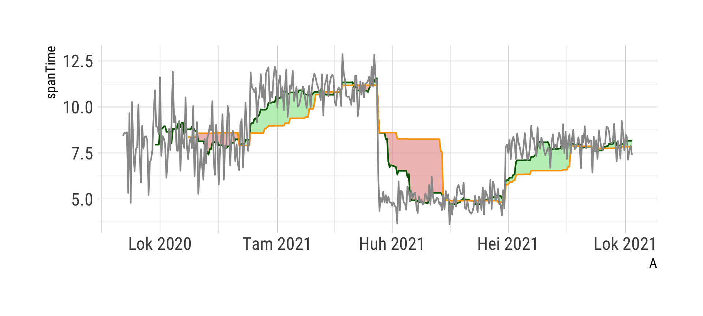

# ichimokuClouds



Ichimoku Cloud is a financial technical analysis (TA) tool. It consists of multiple technical indicators that show support and resistance levels and trend direction for a certain financial instrument (or other time series data).

It is an easy to understand, visual trading signal chart, but why couldn't one use for other purposes too?

### R Program

Here's an R program to illustrate the usage of the Cloud using random data.

The program generates random data, calculates basic Ichimoku Cloud parameters to the dataset, defines colorized ribbons and draws the figure with all the components. One will need `TTR`, `data.table`, `ggplot2` and `hrbrthemes` (optional; good looking themes for ggplot) R libraries.

Please note there are also R library `IKTrading` which has built-in Ichimoku functions to apply these ribbons to financial data.

If you want to try that also, here's the preliminary code for the mandatory R libraries:

```R
#install.packages("devtools") # if not installed
#install.packages("FinancialInstrument") #if not installed
#install.packages("PerformanceAnalytics") #if not installed

## by utilising devtools, install blotter from GitHub
#devtools::install_github("braverock/blotter")
## by utilising devtools, install quantstrat from GitHub
#devtools::install_github("braverock/quantstrat")

#install.packages("remotes") # if not installed
## by utilising devtools, install IKTrading from GitHub
#remotes::install_github("pdrano/IKTrading")

library(quantmod)
library(DescTools)
library(IKTrading)

...
```

NOTE: You must run these code lines in this exact order because of dependencies between the libraries.
